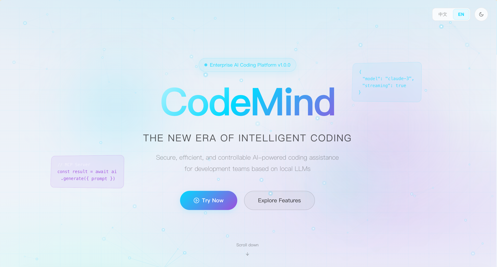
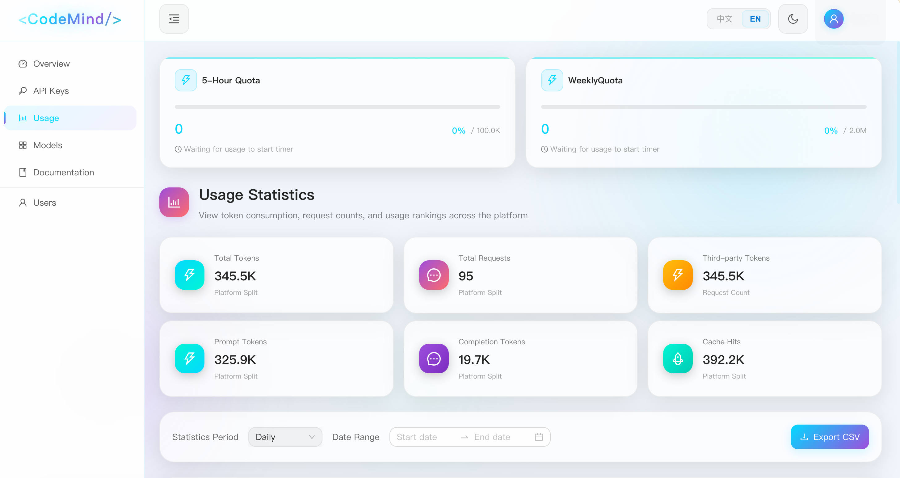
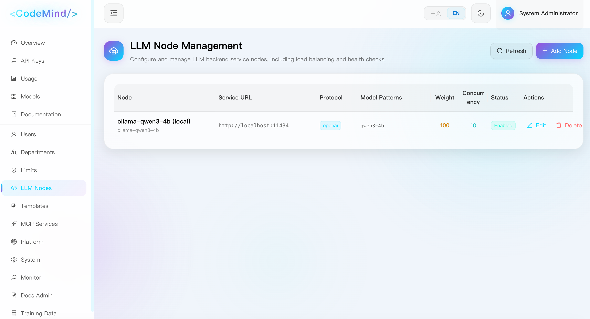

<h1 align="center">🧠 CodeMind</h1>

<p align="center">
  <strong>Enterprise-grade AI Coding Service Management Platform</strong>
</p>

<p align="center">
  <a href="./README.zh-CN.md">简体中文</a> •
  <a href="#features">Features</a> •
  <a href="#quick-start">Quick Start</a> •
  <a href="#documentation">Documentation</a> •
  <a href="#contributing">Contributing</a>
</p>

<p align="center">
  <a href="LICENSE"></a>
  
  
  
  
  
</p>

---

CodeMind is an enterprise-grade AI coding service management platform that acts as an intelligent proxy layer between your organization and LLM providers. It provides unified access control, usage tracking, and resource management for AI coding assistants across your entire organization.

> **🌐 Multi-language Support** — The web interface supports both English and 简体中文, with an easy-to-use language switcher.

## Features

### 🔌 Multi-Provider LLM Proxy
- **OpenAI-Compatible API** — Drop-in replacement for OpenAI API, works with any compatible client
- **Multiple Providers** — Support for various LLM backends with intelligent routing
- **Load Balancing** — Distribute requests across multiple backend instances
- **Streaming Support** — Full SSE (Server-Sent Events) support for real-time responses
- **Third-Party Integration** — Connect to external AI service providers

### 👥 User Management
- **Role-Based Access Control** — Three-tier hierarchy: Super Admin, Department Manager, User
- **Department Organization** — Organize users into departments with separate quotas
- **API Key Management** — Users access services via API Keys with create, disable, and expiration controls

### 📊 Usage Tracking & Quotas
- **Token Usage Statistics** — Track usage by day, week, or month with visual charts
- **Three-Level Quota System** — Configure limits at global, department, and user levels
- **Concurrent Request Control** — Limit simultaneous requests per user or department
- **Real-time Monitoring** — Dashboard with system metrics and usage analytics

### 🔐 Security & Compliance
- **Audit Logging** — Comprehensive operation logs for compliance requirements
- **Encrypted Storage** — Sensitive data encrypted at rest
- **Login Protection** — Account lockout after failed attempts
- **Soft Delete** — Safe data removal with recovery capability

### 🛠 Advanced Features
- **MCP Gateway** — Model Context Protocol support for tool integration
- **Provider Templates** — Pre-configured templates for common LLM providers
- **System Monitoring** — Real-time CPU, memory, and service health metrics

## Screenshots

<p align="center">
  
  <br><em>Landing Page</em>
</p>

<p align="center">
  
  <br><em>Usage Statistics Dashboard</em>
</p>

<p align="center">
  
  <br><em>LLM Node Management</em>
</p>

## Architecture

```
┌─────────────────────────────────────────────────────────────────┐
│                         Clients                                  │
│    (VS Code, Cursor, JetBrains, CLI tools, Custom apps)         │
└─────────────────────────────┬───────────────────────────────────┘
                              │ OpenAI-Compatible API
                              ▼
┌─────────────────────────────────────────────────────────────────┐
│                      CodeMind Platform                           │
│  ┌───────────────┐  ┌──────────────┐  ┌───────────────────────┐ │
│  │   Frontend    │  │   Backend    │  │     LLM Proxy         │ │
│  │  React + TS   │  │   Go + Gin   │  │  Multi-Provider       │ │
│  │  Ant Design   │  │    GORM      │  │  Load Balancing       │ │
│  └───────────────┘  └──────────────┘  └───────────────────────┘ │
│                              │                                   │
│  ┌───────────────┐  ┌──────────────┐  ┌───────────────────────┐ │
│  │  PostgreSQL   │  │    Redis     │  │   Audit & Logging     │ │
│  │   Database    │  │    Cache     │  │                       │ │
│  └───────────────┘  └──────────────┘  └───────────────────────┘ │
└─────────────────────────────┬───────────────────────────────────┘
                              │
                              ▼
┌─────────────────────────────────────────────────────────────────┐
│                      LLM Providers                               │
│     (Self-hosted models, OpenAI, Azure, Third-party APIs)       │
└─────────────────────────────────────────────────────────────────┘
```

## Tech Stack

| Layer      | Technology                                        |
|------------|---------------------------------------------------|
| Frontend   | React 18 + TypeScript + Vite + Ant Design 5 + TailwindCSS |
| Backend    | Go 1.24 + Gin + GORM                              |
| Database   | PostgreSQL 16                                     |
| Cache      | Redis 7                                           |
| Deployment | Docker + Docker Compose + Nginx                   |

## Quick Start

### Prerequisites

- Docker >= 27.x
- Docker Compose >= 2.x

### One-Command Deployment

```bash
# Clone the repository
git clone https://github.com/wskgithub/CodeMind.git
cd codemind

# Copy and configure environment
cp .env.example .env
# Edit .env with your settings (database password, JWT secret, LLM backend URL)

# Start all services
docker compose up -d
```

Access the dashboard at http://localhost (or your configured port).

### Default Credentials

| Username | Password       | Role        |
|----------|----------------|-------------|
| admin    | Admin@123456   | Super Admin |

> ⚠️ **Important**: Change the default password immediately after first login.

### Configure LLM Backend

1. Log in as admin
2. Navigate to **Admin** → **Backends**
3. Add your LLM provider with:
   - Base URL (e.g., `http://your-llm-server:8000/v1`)
   - API Key (if required)
   - Available models

## Development Setup

### Prerequisites

- Go >= 1.24
- Node.js >= 20.x
- Docker & Docker Compose

### Local Development

```bash
# Start infrastructure services
docker compose up -d postgres redis

# Start backend (terminal 1)
cd backend
cp config/app.yaml.example config/app.yaml
go run cmd/server/main.go

# Start frontend (terminal 2)
cd frontend
npm install
npm run dev
```

Frontend: http://localhost:3000  
Backend API: http://localhost:8080

### Running Tests

```bash
# Backend tests
cd backend && go test ./...

# Frontend tests
cd frontend && npm test
```

## Configuration

### Environment Variables

| Variable        | Description                          | Default       |
|-----------------|--------------------------------------|---------------|
| `DB_PASSWORD`   | PostgreSQL password                  | *required*    |
| `JWT_SECRET`    | JWT signing secret                   | *required*    |
| `LLM_BASE_URL`  | Default LLM provider URL             | *required*    |
| `LLM_API_KEY`   | Default LLM provider API key         | -             |
| `FRONTEND_PORT` | Frontend port                        | 80            |
| `BACKEND_PORT`  | Backend API port                     | 8080          |

See [Configuration Guide](docs/configuration.md) for detailed settings.

## API Usage

CodeMind provides an OpenAI-compatible API endpoint. Configure your AI coding tools with:

```
API Base URL: http://your-codemind-server/v1
API Key: <your-codemind-api-key>
```

Example with curl:

```bash
curl http://localhost/v1/chat/completions \
  -H "Authorization: Bearer sk-xxxx" \
  -H "Content-Type: application/json" \
  -d '{
    "model": "your-model",
    "messages": [{"role": "user", "content": "Hello!"}],
    "stream": true
  }'
```

## Project Structure

```
CodeMind/
├── frontend/              # React frontend application
│   ├── src/
│   │   ├── components/    # Reusable UI components
│   │   ├── pages/         # Page components
│   │   ├── services/      # API service layer
│   │   ├── store/         # Zustand state management
│   │   └── types/         # TypeScript definitions
│   └── ...
├── backend/               # Go backend API server
│   ├── cmd/server/        # Application entry point
│   ├── internal/
│   │   ├── handler/       # HTTP handlers
│   │   ├── service/       # Business logic
│   │   ├── repository/    # Data access layer
│   │   ├── model/         # Database models
│   │   └── middleware/    # HTTP middleware
│   └── pkg/llm/           # LLM client library
├── deploy/                # Deployment configurations
├── docs/                  # Documentation
└── docker-compose.yml     # Container orchestration
```

## Documentation

- [Development Setup](docs/dev-setup.md) — Environment setup guide
- [Architecture](docs/architecture.md) — System architecture details
- [API Routes](docs/api-routes.md) — API endpoint reference
- [Configuration](docs/configuration.md) — Configuration options
- [LLM Proxy](docs/llm-proxy.md) — LLM proxy and routing details
- [Security](docs/security.md) — Security practices
- [Deployment Guide](docs/deployment-guide.md) — Production deployment

## Contributing

We welcome contributions! Please follow these steps:

1. Fork the repository
2. Create a feature branch (`git checkout -b feature/amazing-feature`)
3. Commit your changes (`git commit -m 'Add amazing feature'`)
4. Push to the branch (`git push origin feature/amazing-feature`)
5. Open a Pull Request

Please read our [Development Standards](docs/development-standards.md) before contributing.

### Development Guidelines

- Code comments in Chinese (project convention)
- Follow [Backend Standards](docs/backend-standards.md) for Go code
- Follow [Frontend Standards](docs/frontend-standards.md) for React/TypeScript
- Include tests for new features

## Roadmap

- [ ] SSO integration (LDAP, SAML, OAuth)
- [ ] Enhanced analytics and reporting
- [ ] Plugin system for custom providers
- [ ] Multi-language admin interface
- [ ] Kubernetes deployment templates

## License

This project is licensed under the MIT License - see the [LICENSE](LICENSE) file for details.

## Acknowledgments

- [Gin](https://github.com/gin-gonic/gin) — HTTP web framework
- [GORM](https://gorm.io/) — ORM library
- [Ant Design](https://ant.design/) — UI component library
- [Vite](https://vitejs.dev/) — Frontend build tool

---

<p align="center">
  Made with ❤️ for the developer community
</p>
