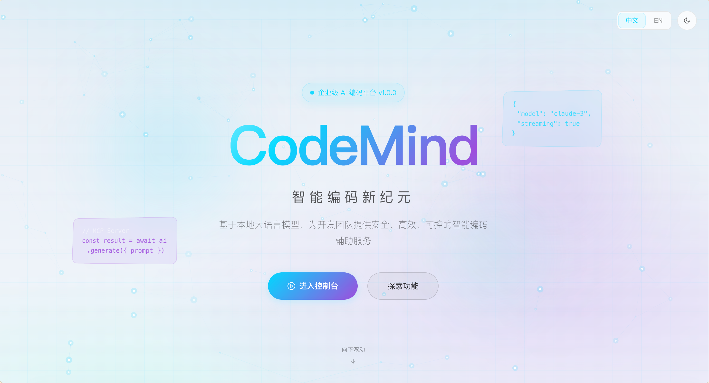
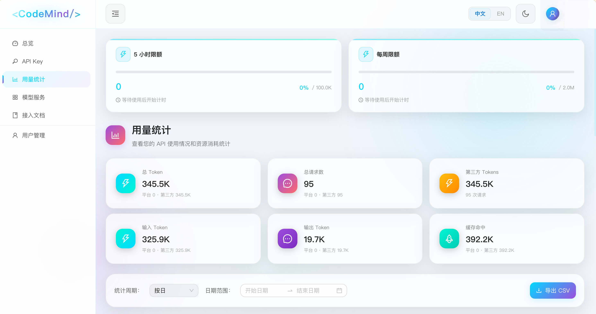
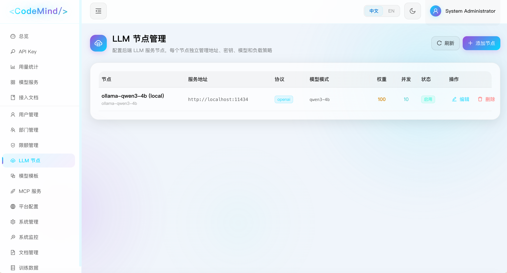

<h1 align="center">🧠 CodeMind</h1>

<p align="center">
  <strong>企业级 AI 编码服务管理平台</strong>
</p>

<p align="center">
  <a href="./README.md">English</a> •
  <a href="#功能特性">功能特性</a> •
  <a href="#快速开始">快速开始</a> •
  <a href="#文档">文档</a> •
  <a href="#参与贡献">参与贡献</a>
</p>

<p align="center">
  <a href="LICENSE"></a>
  
  
  
  
  
</p>

---

CodeMind 是一个企业级 AI 编码服务管理平台，作为组织与 LLM 服务商之间的智能代理层，提供统一的访问控制、用量追踪和资源管理能力，让 AI 编码助手服务于整个组织。

## 功能特性

### 🔌 多服务商 LLM 代理
- **OpenAI 兼容 API** — 完全兼容 OpenAI API 格式，可直接替换现有客户端
- **多服务商支持** — 支持多种 LLM 后端，智能路由分发
- **负载均衡** — 请求自动分发到多个后端实例
- **流式响应** — 完整支持 SSE（Server-Sent Events）实时响应
- **第三方集成** — 轻松接入外部 AI 服务商

### 👥 用户管理
- **基于角色的访问控制** — 超级管理员、部门经理、普通用户三级权限体系
- **部门化管理** — 按部门组织用户，独立配额管理
- **API Key 管理** — 用户通过 API Key 接入服务，支持创建、禁用、过期设置

### 📊 用量追踪与配额
- **Token 用量统计** — 按日、周、月维度统计，可视化图表展示
- **三级配额体系** — 全局、部门、用户三级限额配置
- **并发请求控制** — 按用户或部门限制同时请求数
- **实时监控** — 系统指标和用量分析仪表盘

### 🔐 安全与合规
- **审计日志** — 完整的操作日志，满足合规要求
- **加密存储** — 敏感数据静态加密
- **登录保护** — 多次失败后账户锁定
- **软删除** — 安全的数据删除机制，支持恢复

### 🛠 高级功能
- **MCP 网关** — 支持 Model Context Protocol，实现工具集成
- **服务商模板** — 预配置的常见 LLM 服务商模板
- **系统监控** — 实时 CPU、内存和服务健康指标

## 界面预览

<p align="center">
  
  <br><em>首页</em>
</p>

<p align="center">
  
  <br><em>用量统计仪表盘</em>
</p>

<p align="center">
  
  <br><em>LLM 节点管理</em>
</p>

## 系统架构

```
┌─────────────────────────────────────────────────────────────────┐
│                          客户端                                  │
│       (VS Code, Cursor, JetBrains, CLI 工具, 自定义应用)         │
└─────────────────────────────┬───────────────────────────────────┘
                              │ OpenAI 兼容 API
                              ▼
┌─────────────────────────────────────────────────────────────────┐
│                      CodeMind 平台                               │
│  ┌───────────────┐  ┌──────────────┐  ┌───────────────────────┐ │
│  │    前端       │  │    后端       │  │     LLM 代理          │ │
│  │  React + TS   │  │   Go + Gin   │  │  多服务商路由          │ │
│  │  Ant Design   │  │    GORM      │  │  负载均衡              │ │
│  └───────────────┘  └──────────────┘  └───────────────────────┘ │
│                              │                                   │
│  ┌───────────────┐  ┌──────────────┐  ┌───────────────────────┐ │
│  │  PostgreSQL   │  │    Redis     │  │    审计与日志          │ │
│  │    数据库     │  │     缓存      │  │                       │ │
│  └───────────────┘  └──────────────┘  └───────────────────────┘ │
└─────────────────────────────┬───────────────────────────────────┘
                              │
                              ▼
┌─────────────────────────────────────────────────────────────────┐
│                       LLM 服务商                                 │
│        (自托管模型, OpenAI, Azure, 第三方 API)                   │
└─────────────────────────────────────────────────────────────────┘
```

## 技术栈

| 层级   | 技术                                              |
|--------|---------------------------------------------------|
| 前端   | React 18 + TypeScript + Vite + Ant Design 5 + TailwindCSS |
| 后端   | Go 1.24 + Gin + GORM                              |
| 数据库 | PostgreSQL 16                                     |
| 缓存   | Redis 7                                           |
| 部署   | Docker + Docker Compose + Nginx                   |

## 快速开始

### 环境要求

- Docker >= 27.x
- Docker Compose >= 2.x

### 一键部署

```bash
# 克隆仓库
git clone https://github.com/wskgithub/CodeMind.git
cd codemind

# 复制并配置环境变量
cp .env.example .env
# 编辑 .env 设置数据库密码、JWT 密钥、LLM 后端地址等

# 启动所有服务
docker compose up -d
```

访问 http://localhost（或你配置的端口）进入管理后台。

### 默认账号

| 用户名 | 密码           | 角色       |
|--------|----------------|------------|
| admin  | Admin@123456   | 超级管理员 |

> ⚠️ **重要提示**：首次登录后请立即修改默认密码。

### 配置 LLM 后端

1. 使用管理员账号登录
2. 进入 **管理后台** → **后端管理**
3. 添加 LLM 服务商配置：
   - 基础 URL（如 `http://your-llm-server:8000/v1`）
   - API Key（如需要）
   - 可用模型列表

## 开发环境搭建

### 环境要求

- Go >= 1.24
- Node.js >= 20.x
- Docker & Docker Compose

### 本地开发

```bash
# 启动基础服务
docker compose up -d postgres redis

# 启动后端（终端 1）
cd backend
cp config/app.yaml.example config/app.yaml
go run cmd/server/main.go

# 启动前端（终端 2）
cd frontend
npm install
npm run dev
```

前端访问地址：http://localhost:3000  
后端 API 地址：http://localhost:8080

### 运行测试

```bash
# 后端测试
cd backend && go test ./...

# 前端测试
cd frontend && npm test
```

## 配置说明

### 环境变量

| 变量名          | 说明                    | 默认值    |
|-----------------|-------------------------|-----------|
| `DB_PASSWORD`   | PostgreSQL 数据库密码   | *必填*    |
| `JWT_SECRET`    | JWT 签名密钥            | *必填*    |
| `LLM_BASE_URL`  | 默认 LLM 服务商地址     | *必填*    |
| `LLM_API_KEY`   | 默认 LLM 服务商 API Key | -         |
| `FRONTEND_PORT` | 前端服务端口            | 80        |
| `BACKEND_PORT`  | 后端 API 端口           | 8080      |

详细配置请参考 [配置指南](docs/configuration.md)。

## API 使用

CodeMind 提供 OpenAI 兼容的 API 端点，配置你的 AI 编码工具：

```
API Base URL: http://your-codemind-server/v1
API Key: <你的 CodeMind API Key>
```

curl 示例：

```bash
curl http://localhost/v1/chat/completions \
  -H "Authorization: Bearer sk-xxxx" \
  -H "Content-Type: application/json" \
  -d '{
    "model": "your-model",
    "messages": [{"role": "user", "content": "你好！"}],
    "stream": true
  }'
```

## 项目结构

```
CodeMind/
├── frontend/              # React 前端应用
│   ├── src/
│   │   ├── components/    # 可复用 UI 组件
│   │   ├── pages/         # 页面组件
│   │   ├── services/      # API 服务层
│   │   ├── store/         # Zustand 状态管理
│   │   └── types/         # TypeScript 类型定义
│   └── ...
├── backend/               # Go 后端 API 服务
│   ├── cmd/server/        # 应用入口
│   ├── internal/
│   │   ├── handler/       # HTTP 处理器
│   │   ├── service/       # 业务逻辑层
│   │   ├── repository/    # 数据访问层
│   │   ├── model/         # 数据库模型
│   │   └── middleware/    # HTTP 中间件
│   └── pkg/llm/           # LLM 客户端库
├── deploy/                # 部署配置
├── docs/                  # 项目文档
└── docker-compose.yml     # 容器编排
```

## 文档

- [开发环境搭建](docs/dev-setup.md) — 环境配置指南
- [系统架构](docs/architecture.md) — 架构设计详解
- [API 路由](docs/api-routes.md) — API 接口参考
- [配置指南](docs/configuration.md) — 配置选项说明
- [LLM 代理](docs/llm-proxy.md) — LLM 代理与路由机制
- [安全规范](docs/security.md) — 安全实践
- [部署指南](docs/deployment-guide.md) — 生产环境部署

## 参与贡献

欢迎参与贡献！请按以下步骤：

1. Fork 本仓库
2. 创建特性分支 (`git checkout -b feature/amazing-feature`)
3. 提交更改 (`git commit -m '添加某个特性'`)
4. 推送分支 (`git push origin feature/amazing-feature`)
5. 提交 Pull Request

提交代码前请阅读 [开发规范](docs/development-standards.md)。

### 开发规范

- 代码注释使用中文（项目约定）
- Go 代码遵循 [后端开发规范](docs/backend-standards.md)
- React/TypeScript 代码遵循 [前端开发规范](docs/frontend-standards.md)
- 新功能需包含测试用例

## 路线图

- [ ] SSO 集成（LDAP、SAML、OAuth）
- [ ] 增强分析与报表功能
- [ ] 自定义服务商插件系统
- [ ] 多语言管理界面
- [ ] Kubernetes 部署模板

## 许可证

本项目采用 MIT 许可证 - 详见 [LICENSE](LICENSE) 文件。

## 致谢

- [Gin](https://github.com/gin-gonic/gin) — HTTP Web 框架
- [GORM](https://gorm.io/) — ORM 库
- [Ant Design](https://ant.design/) — UI 组件库
- [Vite](https://vitejs.dev/) — 前端构建工具

---

<p align="center">
  用 ❤️ 为开发者社区打造
</p>
